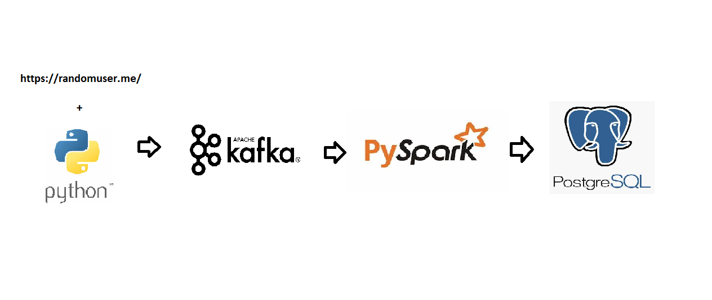

# Pyspark structure with kafka

Project to build a pipeline to process streaming data



### Prerequisites

The things you need before installing the software.

* Python 3.12
* Apache Kafka
* Apache Spark 3.4.5
* Postgres 14

### Installation and Usage
Run docker container: 

```
$ docker-compose up -d
```

Create kafka topic :

```
$ docker exec -it broker sh
$ kafka-topics.sh --create --bootstrap-server --topic user-topic
```

Run Notebook [data_streaming_Simulator.ipynb](./data_streaming_Simulator.ipynb) to simulate streaming server

Run Notebook [create_db.ipynb](./create_db.ipynb) to create db in postgres server

Run Notebook [pyspark_transform.ipynb](./pyspark_transform.ipynb) to handle, transform and load data into postgres database.


